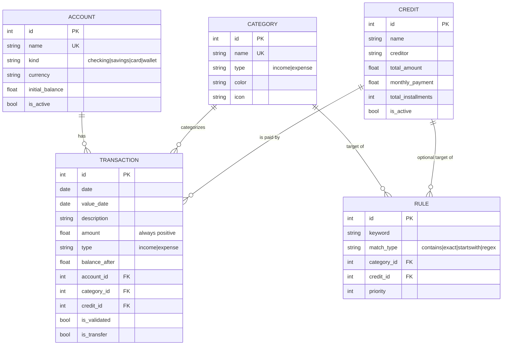

# Data model

> The full SQLite schema, the relationships between entities, and the constraints worth knowing. Defined in [`backend/database/models.py`](../backend/database/models.py).

## Entity relationship



## Tables

### `categories`

Budget buckets. The only table that's seeded with default rows (generic Portuguese names — Salário, Habitação, Energia, Supermercado, Transportes, …).

| Column | Type | Notes |
|--------|------|-------|
| `id` | INTEGER PK | |
| `name` | VARCHAR(80) UNIQUE NOT NULL | |
| `type` | VARCHAR(10) NOT NULL | `income` or `expense` |
| `color` | VARCHAR(20) NOT NULL | Hex, used by the pie chart and badges |
| `icon` | VARCHAR(40) NOT NULL | lucide icon name; UI uses it loosely |

**Delete behavior:** nulls `transactions.category_id` and flips `transactions.is_validated = False` on every linked row, so they reappear in the Validação queue. Cascades to rules.

### `accounts`

The user's bank accounts, cards and e-money wallets. **Never seeded** — created by the user via Backoffice → Contas.

| Column | Type | Notes |
|--------|------|-------|
| `id` | INTEGER PK | |
| `name` | VARCHAR(80) UNIQUE NOT NULL | Free-form, user-facing |
| `kind` | VARCHAR(20) NOT NULL | `checking` / `savings` / `card` / `wallet` |
| `currency` | VARCHAR(8) NOT NULL | Defaults to `EUR`; the UI is EUR-only today |
| `color` | VARCHAR(20) NOT NULL | Hex |
| `icon` | VARCHAR(40) NOT NULL | |
| `initial_balance` | FLOAT NOT NULL | Balance before any imported transaction; defaults to 0 |
| `is_active` | BOOLEAN NOT NULL | Inactive accounts still appear, dimmed |
| `notes` | VARCHAR(500) | |

**Derived (not stored):**
- `current_balance = initial_balance + Σ(income) − Σ(expense)` over linked transactions
- `transaction_count`

**Delete behavior:** nulls `transactions.account_id` on every linked row.

### `credits`

Loans and credit lines. **Never seeded** — created by the user via Backoffice → Créditos.

| Column | Type | Notes |
|--------|------|-------|
| `id` | INTEGER PK | |
| `name` | VARCHAR(120) NOT NULL | E.g. "Sofá" |
| `creditor` | VARCHAR(80) NOT NULL | E.g. "Cofidis" — free-form, user-entered |
| `total_amount` | FLOAT NOT NULL | Total amount to be repaid (principal + interest) |
| `monthly_payment` | FLOAT NOT NULL | Fixed installment |
| `total_installments` | INTEGER NOT NULL | E.g. 36 |
| `interest_rate` | FLOAT NULL | Annual % (TAEG); not used for computation, informational |
| `start_date` | DATE NULL | |
| `end_date` | DATE NULL | Expected end |
| `is_active` | BOOLEAN NOT NULL | |
| `color` | VARCHAR(20) NOT NULL | |
| `notes` | VARCHAR(500) | |

**Derived (not stored):**
- `amount_paid = Σ(transaction.amount WHERE credit_id = X)`
- `installments_paid = round(amount_paid / monthly_payment)`
- `amount_remaining`, `installments_remaining`, `progress_pct`, `last_payment_date`

See [RULES.md](RULES.md) for how transactions get linked to credits automatically.

**Delete behavior:** nulls `transactions.credit_id` on every linked row.

### `transactions`

Every imported or hand-entered bank line. The core fact table.

| Column | Type | Notes |
|--------|------|-------|
| `id` | INTEGER PK | |
| `date` | DATE NOT NULL, INDEX | "Data Operação" — when the bank posted it |
| `value_date` | DATE NULL | "Data valor" — when it affects available balance |
| `description` | VARCHAR(500) NOT NULL | The raw bank line |
| `amount` | FLOAT NOT NULL | **Always positive**; sign of the movement lives in `type` |
| `type` | VARCHAR(10) NOT NULL | `income` / `expense` |
| `balance_after` | FLOAT NULL | "Saldo Contabilístico" — used for dedupe |
| `account_id` | INTEGER FK NULL | One account per transaction (nullable so deleting an account doesn't destroy data) |
| `category_id` | INTEGER FK NULL | Set by rules or by the user |
| `credit_id` | INTEGER FK NULL | When this transaction services a loan |
| `is_validated` | BOOLEAN NOT NULL | User has confirmed the category |
| `is_transfer` | BOOLEAN NOT NULL | Excluded from income/expense aggregations |
| `source_file` | VARCHAR(255) NULL | Filename it was imported from |
| `created_at` | DATETIME NOT NULL | UTC import timestamp |

**Dedupe key (enforced in code, not at the DB level):**
```
(account_id, date, description, amount, balance_after)
```
See [IMPORT.md](IMPORT.md#dedupe) for why `balance_after` participates and how NULLs are handled.

### `rules`

User-defined auto-categorization rules.

| Column | Type | Notes |
|--------|------|-------|
| `id` | INTEGER PK | |
| `keyword` | VARCHAR(200) NOT NULL | Pattern to match against `description` (case-insensitive) |
| `match_type` | VARCHAR(20) NOT NULL | `contains` / `exact` / `startswith` / `regex` |
| `category_id` | INTEGER FK NOT NULL | Required — what bucket to put it in |
| `credit_id` | INTEGER FK NULL | Optional — also link to a loan |
| `priority` | INTEGER NOT NULL | Lower runs first; default 100 |
| `created_at` | DATETIME NOT NULL | |

See [RULES.md](RULES.md) for matching semantics and priority resolution.

## Cross-cutting invariants

- **`amount` is always positive.** The importer flips the sign and stores `type`. Reporting queries become trivial SUMs by `type` instead of conditional aggregations.
- **`is_transfer = True` is always excluded** from `/api/dashboard/*` aggregations. There's no UI to set this on import — the user toggles it manually after the fact via the ↔ button in Transações.
- **Manual edits are sticky.** `apply_rules` only ever assigns `category_id` to rows where it's currently NULL. Once a transaction has a category — set by the user or a previous rule — no rule will overwrite it.
- **No cascading deletes by default.** Deleting a Category, Account or Credit nulls the corresponding FK on linked transactions; transactions are not removed.

## Migrations

There aren't any. Schema changes ship with a note in the changelog telling the user to delete `backend/euroly.db`. Default categories will be re-seeded automatically; accounts, credits, transactions and rules are lost. For a personal-use app this is acceptable; if Euroly ever grows up, [Alembic](https://alembic.sqlalchemy.org/) is the obvious next step.
